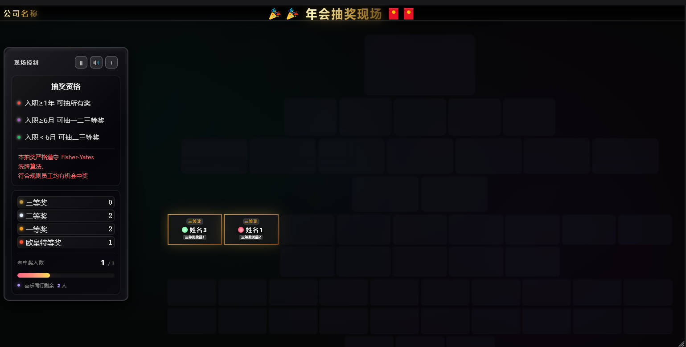

# 🏆 工业级企业年会抽奖系统 (Production-Ready)

[](https://opensource.org/licenses/MIT)
[](https://github.com/RootRichie999)

这是一个基于原生 **HTML5 / JavaScript** 开发的高可靠性抽奖系统。它不是一个简单的视觉 Demo，而是经历过真实大型年会现场考验的“实战版”程序，专门针对现场可能出现的各种突发状况进行了防御性编程。

## 🖼️ 运行预览 (Preview)



## 🌟 为什么选择这个系统？

在年会抽奖现场，技术负责人压力最大的不是特效够不够酷，而是**“万一网页崩了怎么办？”**、**“万一误刷新了怎么办？”**。本项目针对这些痛点设计了多重防御机制：

### 1. 🛡️ 钢铁级的容错保护
* **断点续传（双重持久化）**：系统实时同步中奖数据至 `LocalStorage` 并维护备份镜像。哪怕浏览器崩溃、电脑掉电或意外关机，重启后依然能**精准找回进度**。
* **快捷键物理锁定**：自动屏蔽 `F5`、`Ctrl+R`、`回车键`及`鼠标右键`。彻底杜绝因操作紧张或现场观众误触导致的页面刷新。
* **验证码强制换挡**：在切换“特等奖”等重要奖项前，必须输入随机 4 位验证码。强制操作者二次确认，防止由于“手快”抽错奖项。
* **物理暂停开关**：内置 `isFrozen` 逻辑，可一键物理禁用空格键推进，完美配合现场领导致辞节奏。

### 2. 🎯 公平且灵活的算法
* **Fisher-Yates Shuffle**：采用经典洗牌算法，确保数学意义上的绝对公平。
* **多级资格校验**：支持根据员工入职时长（如 1年/6个月/新入职）自动划分 A/B/C 抽奖池资格。
* **确认入框机制**：抽中 -> 锁定 -> 手动确认入框。为现场“避让逻辑”或“意外重抽”预留宝贵的人工干预空间。

### 3. 📺 大屏优化与视觉
* **多模式适配**：内置 1080P 标准显示器与 **1536×768（大型P3投影幕布）** 专项 UI 预设，确保在大屏上不重叠、不遮挡。
* **视觉分层**：特等奖专属“皇冠”置顶仪式感及花落喷絮粒子特效。

---

## 📂 文件结构
```text
.
├── index.html          # 核心程序（逻辑、样式、UI全集成）
├── LICENSE             # MIT 许可证
├── README.md           # 项目自述
├── images/             # 文档图片文件夹
└── png2/               # 资源目录（需自备）
    ├── bgm.mp3         # 背景音乐
    ├── win.mp3         # 中奖音效
    └── [奖品名称].png   # 自动匹配奖品名的图片，建议 600*400 像素